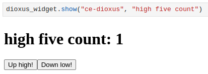

# Jupyter and Dioxus

This repo contains:

- The python package `dioxus_widget`, which can dioxus components in an jupyter notebook.
- A rust project that exposes dioxus components to `dioxus_widget`.
- A demo that demonstrates how to use this software.

## Run the Demo

```sh
git clone https://github.com/JJJHolscher/jupyter-and-dioxus
cd jupyter-and-dioxus
cargo install wasm-pack
wasm-pack build --target web
python -m venv .venv
. .venv/bin/activate
pip install jupyterlab
cd doc
jupyter lab
```

Your browser opens jupyter lab, you open `demo.ipynb` and you run all.
You should now get a screenshot like this:



Which means the demo worked.

## Workflow

0. Add this git repo to your Cargo.toml.
1. Create a Dioxus component in Rust that implements the LaunchInElement Trait. See `src/lib.rs` for an example.
2. Run `wasm-pack build --debug --target web` such that your components are put into a bunch of js and wasm files in some directory (probably `YOUR_RUST_PACKAGE_ROOT/pkg`).
3. `pip install dioxus_widget` 
4. In jupyter, `import dioxus_widget; dioxus_widget.init(JS_PATH)`. JS_PATH is the javascript file you'd normally import in the html module script for loading in the wasm. It's usually found at `YOUR_RUST_PACKAGE_ROOT/pkg/YOUR_RUST_PACKAGE_NAME.js` .
5. `dioxus_widget.show(FUNCTION_NAME_FOR_LAUNCHING_COMPONENT, DATA_TO_SEND)`

tadaa, now you get an iframe into a document that is empty, aside from your dioxus component.

6. `dioxus_web.close()` run this to remove temporary html files, only run this after you're done looking at your widgets.


## Q&A

> Why is the dioxus element inside an iframe?

Some bug in `dioxus_web` disallowed the instantiation of multiple dioxus elements in a single document. Once this is patched, I'll drop the iframes and `dioxus_web` won't need to launch a server anymore or create temporary files.

> Can I access any javascript variables or rust-variables-exposed-to-javascript from python?

Due to that `dioxus_web` bug, you'll have to extract those from the created iframe, this should become more convenient in the future.  
But, you'll have to do that work yourself. This package is aimed to (at some point) work with Quarto, which allows you to create a _static_ website from jupyter notebook files. So, no server calls.  
This means that in Quarto, the python code only gets executed once, during the static site generation. The Dioxus widgets then get run on the client's device but the client's device won't be able to run any python code so the python code cannot respond to anything happening in Dioxus or javascript.  

> What is that doc/_quarto.yml?

[Quarto](quarto.org) allows you to convert markdown(-like) files into a website (or book, or article). The rad thing is that Quarto runs any code cells in the markdown.
At some point I will also test whether the dioxus widgets work in quarto-generated files.

> Does my notebook file need to be on the same device as the wasm and javascript that was generated by dioxus?

Yea, though not in theory.  
I made this library assuming you have the files locally so out of the box you won't be able to link to remote files when calling `dioxus_widget.init`.  
But it would be simpler if the dioxus-generated files are served from an already-existing separate server.
There's a decent chance I'll implement this simple change at some point, though for my personal use I won't need to now.

> Will you support different front-end libraries, like Yew or React?

Probably not since I don't plan to use other libraries. If I do, then they'll probably become included here.  
Also I might add them if you pay me.

> Why so many globals in the python package?

I don't want to burden the end user with keeping track of any state.  
The cost of that is that the `dioxus_widget.init` function cannot be called twice. You get to load 1 package, and that package should contain all the dioxus components you'd want to invoke later.  
To me, this is obviously flawed, but for my personal purposes it will do. This facet might (breakingly) change later.

> What is the status of this repo?

This repo is a personal tool that is, right now, in active use. If you see that this repo stopped getting commits, I possibly stopped using it.  
Because it's a personal tool, I won't be shy about introducing breaking changes, and the documentation might get outdated quickly.

Thus far it's pretty small though, and I don't see it bulking anytime soon, so if you make sure to note which commit you're using and don't mind checking the python and rust source code in case of trouble, you should be able to use this well.

And, it need barely be said, but the more you pay me the more pleasant this repo becomes for you.
